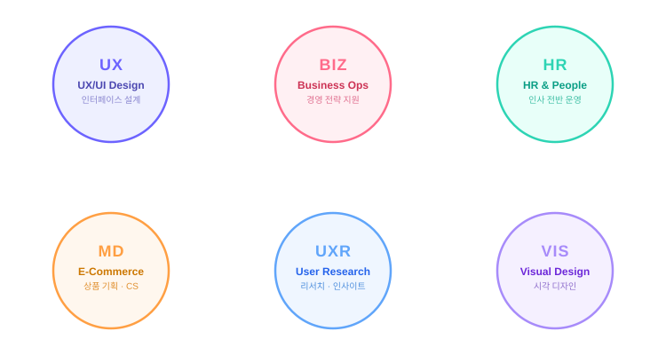

# Hi 👋, I'm Jeongwoo Park

**Business | HR | E-Commerce | UX/UI Design**

### UX/UI DESIGNER

- 🌱 I'm currently learning **AI/UXUI**

- 📫 How to reach me **lbaikal1742@gmail.com**

- 👨‍💻 All of my projects are available at **[https://jeongwoo-pjw.github.io/](https://jeongwoo-pjw.github.io/)**

<h3 align="left">Connect with me:</h3>

<h3 align="left">Languages and Tools:</h3>

     

---

## 💼 Career

| 기간 | 직책 | 회사 / 과정 | 분야 |
|------|------|-------------|------|
| - | 🎓 **UX/UI 디자이너 부트캠프 수료** | 부트캠프 과정 | `Design` |
| - | 🛒 **온라인몰 상세페이지 MD · CS 담당자** | NC백화점 온라인몰 | `E-Commerce` |
| - | 👥 **인사관리자** | 국제산공(주) | `HR` |
| - | 🎯 **회장 및 CEO 개인비서** | 국제산공(주) | `Business` |

---

## 🧩 What I Do

**🎯 경영 지원 · Executive Assistant**
- 회장 및 CEO 일정 조율 및 출장·행사 기획·운영
- 기밀 문서 관리 및 의사결정 지원 보고서 작성
- 사내외 주요 커뮤니케이션 창구 역할 수행

**👥 인사 관리 · Human Resources**
- 채용 공고, 면접 운영, 온보딩 프로세스 설계
- 급여 · 복리후생 · 근태 관리 및 노무 업무
- 사내 교육 프로그램 및 조직 문화 활동 운영

**🛒 이커머스 · E-Commerce MD · CS**
- 상품 상세페이지 기획 · 콘텐츠 작성 및 업로드
- 고객 문의 · 클레임 응대 및 VOC 데이터 분석
- 프로모션 기획 및 상품 운영 전략 수립 참여

**✏️ UX/UI 디자인 · Design**
- 사용자 조사 · 퍼소나 · 고객 여정 지도 작성
- 와이어프레임 · 프로토타입 제작 (Figma)
- UI 디자인 시스템 구축 및 가이드라인 작성

---

## 🎯 Focus Areas

---

## 🛠️ Skills & Tools

**Design**
`Figma` `Framer` `Adobe Illustrator` `Adobe Photoshop` `Blender`

**Office**
`Microsoft Excel` `Microsoft PowerPoint`

**Collaboration**
`GitHub`

---

## 📬 Contact

| Channel | Details |
|---------|---------|
| 📧 **Email** | [lbaikal1742@gmail.com](mailto:lbaikal1742@gmail.com) |
| 🐙 **GitHub** | [jeongwoo-pjw](https://github.com/jeongwoo-pjw) |
